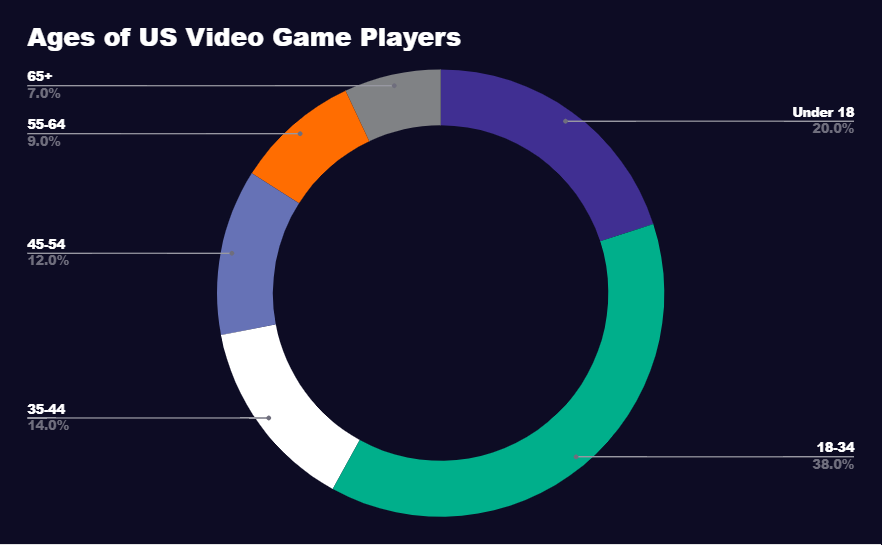

# 1.1 Problem Identification

## Why make a Video Game?

Recently the Covid-19 Pandemic has been becoming less of an influence on peoples lives as people are getting vaccinated less people are having to spend time inside (Gallagher, 2022). Therefore the number of people playing video games is decreasing, however as written by (Epstein, 2020) the number of video game players will likely return to a much higher baseline as the pandemic has introduced new players and most of them will likely keep following the hobby in some way. This makes now an ideal time to release video games as the market is bigger than ever and players may still have reasons why they have lots of free time such as having to isolate.

In the US alone only 20% of players in 2021 were below the age of 18 (Clement, 2021); therefore I believe it would be sensible to cater to players above the age of 16 as it would allow me to reach the largest part of the market. It would also mean players who prefer games meant for adults would be more willing to play as they would be happy that it was designed with a 16+ year old playing.

Moreover 80% of players aged 18-34 played for 3+ hours a week (Entertainment Software Association, 2021) meaning that any game made would need to be extensive to support this much playtime and 31% of all gamers played adventure games (Entertainment Software Association, 2021) which is the style I am aiming for as I can cater towards an adult audience in this genre with a survival-horror style game.

Gaming can also have positive benefits for the brain as well; research has shown that video games that offer players a wide range of stimulations and increasing difficulty can increase the brains resistances to conditions such as Alzheimer's that are caused by aging (Baxter, 2011).  This would be ideal for the kind of audience I am aiming for as people 16-34 might not be thinking about conditions such as Alzheimer's as the time when it can occur seems so for away; however if I could implement a small number of features that could benefit the players health in the future then that would be very beneficial for the player.

To add to this point according to research by the ESA (Entertainment Software Association, 2021) around 90% of players said that video games were a joyful experience for them and 87% said that video games provided mental stimulation and also said that playing video games relieved stress. This is important and relates to the last point as providing mental stimulation means the player is using their brain enough to reduce the chances of brain-related illnesses like Alzheimer's (Baxter, 2011).

> "I have learned problem solving skills and communication skills. I have learned to become more adaptable."

A player on the benefits of playing video games for them (Entertainment Software Association, 2021).
