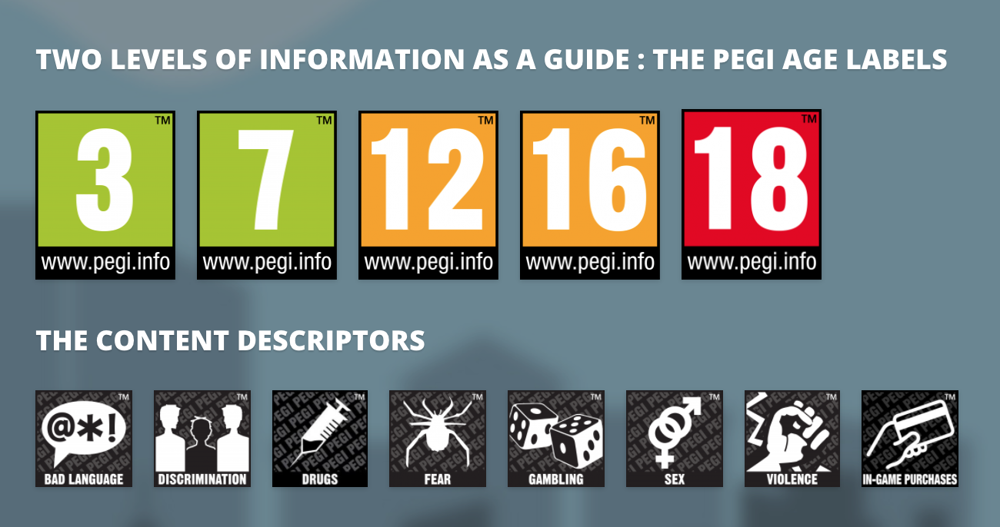

# 1.2 Stakeholders

### Stakeholders

As outlined in [1.1 Problem Identification](1.1-problem-identification.md) the majority of players are above the age of 12 and outlined in the section below is how I believe my game will fit this age rating. Furthermore it would be beneficial to appeal to the largest part of the market possible and between the ages of 12-34 is a significant part of the market. This is because the game will not be applicable to those below the age of 12 as outlined below; and that the game will likely not appeal to those above the age of 34 as those aren't the people often playing horror games.

The game will also have a varying difficulty level as the age range of 12-34 is large and players will likely need more of a challenge depending on if they are over or under 18

### PEGI Rating

This game will be aimed towards PEGI 12 and above as the majority of players are above this age and I would like to add elements that may not be appropriate for an audience younger than 12. For example elements of horror and complex mechanics that may not be appropriate.

The PEGI description for PEGI 12 is as follows:

> "Video games that show violence of a slightly more graphic nature towards fantasy characters or non-realistic violence towards human-like characters would fall in this age category. Sexual innuendo or sexual posturing can be present, while any bad language in this category must be mild." (PEGI, 2017)

My game will involve slightly graphic violence, as there is an element of danger for the player and the characters they control, however because it is 2D it will be limited and there is no need to warrant anything above a PEGI 12 rating. Moreover there will be no other content descriptors such as gambling, discrimination or in-game purchases as it is not relevant to the game; furthermore the swearing will be limited and likely only used in brief.

Moreover if we are to compare it to the PEGI 16 rating then it is not applicable as it states:

> This rating is applied once the depiction of violence (or sexual activity) reaches a stage that looks the same as would be expected in real life. The use of bad language in games with a PEGI 16 rating can be more extreme, while the use of tobacco, alcohol or illegal drugs can also be present. (PEGI, 2017)

Therefore demonstrating that it is not appropriate as it would require a realistic depiction of violence and due to the limited graphics of the game this does not apply. On top of this there will be limited reference to drugs (and not illegal ones) and bad language will not be extreme.

