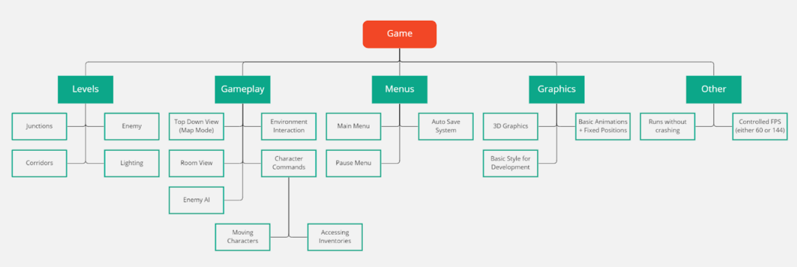

# 2.1 Design Frame

## Systems Diagram



text here

## Usability Features

text here

### Effective

text here

#### Aims

* Create a clear goal to reach to determine the end of a level
* Create a clear goal for any multiplayer modes

### Efficiency

text here

#### Aims

* Create a menu system that is quick and easy to navigate through
* Create a controls system that isn't too complicated but allows the player to do multiple actions

### Engaging

text here

#### Aims

* Create a series of levels to work through
* Create a multiplayer mode to play
* Incorporate a style of game art the suits the game

### Error Tolerant

text here

#### Aims

* The game doesn't crash
* The game does not contain any bugs that damage the user experience

### Easy To Learn

text here

#### Aims

* Create a list of controls for the game
* Create an in-level guide that helps players learn how to play the game

## Pseudocode for the Game

### Pseudocode for game

text here

```
```

### Pseudocode for a level

text here

```
```
