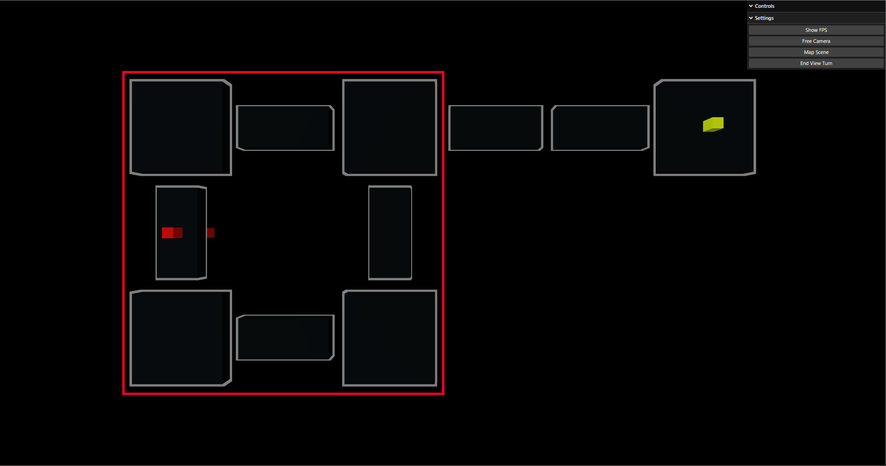

# 4.1 Evaluation of Success Criteria

## Non-Functional Requirements

### Criteria

| Ref Number | Description                               | When was it achieved  |
| ---------- | ----------------------------------------- | --------------------- |
| 1          | Game should run without crashing          | CYCLE 9               |
| 2          | Minimum of 60FPS whilst playing.          | CYCLE 1               |
| 3          | Game is easy to learn and hard to master. | See Usability Testing |
| 4          | Horror / Intense Atmosphere.              | Not met               |

### Criterion 1

As mentioned in [3.1 Testing for Function and Robustness](../3-testing/3.1-robustness.md#criterion-1) the game does have bugs however there is only one truly game breaking bug; this was caused by me forgetting to remove one of the imports from `exports.js`. However now that this is fixed there are no game breaking bugs, and now that this was one that it was impossible for the player to cause.

This means now that there are still a few remaining issues:

* Whilst in the scene view for individual rooms, it is possible to still interact with the MAP elements despite them being in a separate scene. This is due to the elements being in similar places despite being in different scenes; it is either a problem of THREE.js or the DomEvents library that I have used.
* The Camera is not perfectly aligned above the MAP scene meaning that it is possible to click on the edges of the cubes and not trigger anything. This is caused by the camera not being orthographic (fully top down) however this causes more errors if it is orthographic/
* The Window Resize function only works one way, meaning that if the screen gets larger it adjusts, but if the screen gets smaller it instead creates scroll bars. This is because of the default CSS overflow property being set as scroll.
* The UI in the top right overlaps with the very top of the map screen depending on the size of the users monitor. This is due to the UI being fixed in the top right position, this is a problem with THREE as the UI is a built-in module.

### Criterion 2

As demonstrated in some of the videos in cycles like [Cycle 9](../design-and-development/cycle-9-final-patch.md#video-evidence) the FPS always runs at 60 or above no matter the device it is being used on. In fact depending on the machine it's on it can run faster at FPS like 144. It is decided by whatever the users monitor supports and most modern monitors now support 60 and above.

### Criterion 3

The game was supposed to initially scale in difficulty as the player became more adept at the game and also contain more advanced mechanics for players who played a lot. However due to time a lot of these more advanced mechanics were not implemented as it would have taken too long to implement.

### Criterion 4

As mentioned in criterion 3 a lot of the more advanced mechanics that were planned were not implemented because of time. This includes adding atmosphere to the game such as sound effects and also making the game feel more like a horror game; therefore the game is sadly lacking a true horror game atmosphere.

## The Enemy

### Criteria

| Ref Number | Description                 | When it was achieved          |
| ---------- | --------------------------- | ----------------------------- |
| 5          | Functioning behaviour tree. | Partially achieved in Cycle 8 |
| 6          | Turn Based Movement         | Cycle 8                       |
| 7          | Up and Down Time            | Partially achieved in Cycle 8 |

### Criterion 5

Giving the enemy character a full behaviour tree would have been extremely difficult given the constraints of THREE.js and having to create a whole framework for my game before being able to add much actual gameplay. Therefore, this feature is only partially implemented as the enemy does patrol around part of the map; however, it is not fully implemented as the behaviours are limited to patrolling and attacking the player.

<figure><figcaption>
The rooms the enemy patrols are inside the red square.
</figcaption></figure>

Moreover, the way the patrol system works is based off of the system used for controlling which rooms are connected. The enemy will pick a random room to go to from the first two connected rooms in the room data; due to the corridor that goes right being the third one in the array the enemy never looks at that as a potential route. Again, showing how the enemy doesn't have true "AI" and meaning again that this is only partially implemented.

### Criterion 6

This feature was successfully implemented in Cycle 8 as it was much easier to make the game somewhat turn based for both the player and the developer's sake. As mentioned in Cycle 8 the way this works is that the player and enemy both have separate turn objects that store who's turn it is and then whenever the player does an action they switch.

Also of mention is that if the enemy were to move every turn then the game would be impossible to lose therefore there is only a 40% chance the enemy moves.

### Criterion 7

The idea was, similar to that of Alien: Isolation, that the game would have up and down time to give the player some time to recover after just having a stressful experience. This was only partially implemented as the player can retreat to certain parts of the map as respite from the patrolling enemy however this doesn't apply to the whole map and is therefore only partially implemented.

## The Character
