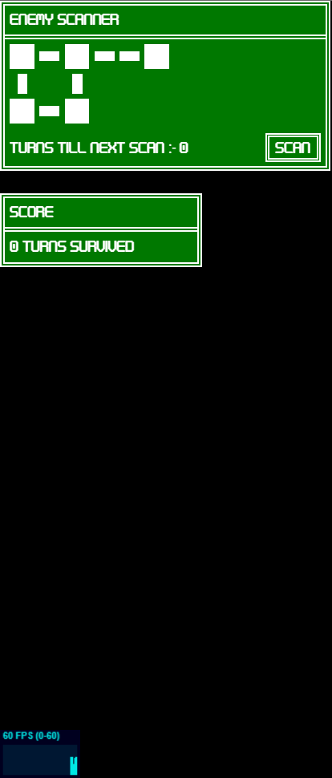

# CYCLE 10 Bonus Patch

## Design

### Objectives

Cycle 10 is a bonus patch to add more features to the game and make the UI better to give the game a more polished feel. In this patch it will be important to come up with a theme and look for the game, as well as improve all the UI.

* [x] Make Room Scanner.
* [x] Make Room Scanner have a cooldown.
* [x] Make enemy only visible when close to player.
* [x] Make turn counter.
* [x] Customise control menu CSS.
* [x] Help UI element to explain features to players.

### Key Variables

| Variable Name | Usage |
| ------------- | ----- |
|               |       |
|               |       |

## Development

**Development Part 1:** Enemy Visibility

The easiest way to make the enemy only visible when in the adjacent rooms was to create a flat donut shape that follows the player around. This works because it only allows the camera to see a small section of the map. To make this shape I used a `THREE.LatheGeometry` and a custom set of coordinates to build a shape.

<pre class="language-javascript" data-title="game.js [part of]" data-overflow="wrap"><code class="lang-javascript"><strong>// shape coordinates
</strong><strong>let points = [
</strong>    new THREE.Vector3(10,0,80), //top left
    new THREE.Vector3(25,0,50), //top right
    new THREE.Vector3(25,0,-50), //bottom right
    new THREE.Vector3(10,0,-50), //bottom left
    new THREE.Vector3(10,0,50) //back to top left - close square path
]

// creating mesh from points
let mesh = new THREE.Mesh( new THREE.LatheGeometry(points), new THREE.MeshLambertMaterial({color: 0x000000}) )
mesh.position.set(0,5,0);

// adding mesh to map screen
MapView.add(mesh);
</code></pre>

I also had to make sure that the shape would follow the player around when they moved, to do this I added a line into the animate function (that runs every frame). This function updates the position of the shape relative to that of the player.


```javascript
function animate() {
    // setting mesh (shape) position to that of character class
    mesh.position.set(
        character.mesh[0].position.x, 
        5, 
        character.mesh[0].position.z);
}

// running function every frame
animate()
```


In the pictures below I have edited the colour of the shape to make it more visible, however the normal colour is black.

<figure><figcaption><p>Demonstration of the shape placed over the map, as viewed from the free camera.</p></figcaption></figure>


Demonstration of how the enemy cover looks in game, except the colour is changed for easier viewing.


**Development Part 2:** Room Scanner + Turn Counter

To create the room scanner: I first started by making the UI, this involved mostly HTML and then I would switch the classes of the div element, depending on whether it was occupied or not. I also made the scanner so it only detects when it is in the junction (square) rooms. Furthermore, to make it so the scanner can only be used every two turns I added a turn counter to the view turn class.



Part of the game.html file, the CSS used will be included inside the complete code section as it is too long.


```html
<!-- part of the body tag -->
<body>
    <div class="scan-ui">
        <p class="scan-title">Enemy Scanner</p>
        <div class="scan-container">
            <!-- the scanning ui is made of a reusable blocks -->
            <div class="row-1">
                <div class="junction-element" id="row-1-1"></div>
                <div class="spacer"></div>
                <div class="corridor-element" id="row-1-2"></div>
                <div class="spacer"></div>
                <div class="junction-element" id="row-1-3"></div>
                <div class="spacer"></div>
                <div class="corridor-element" id="row-1-4"></div>
                <div class="spacer"></div>
                <div class="corridor-element" id="row-1-5"></div>
                <div class="spacer"></div>
                <div class="junction-element" id="row-1-6"></div>
            </div>
            <div class="row-2">
                <div class="vertical-corridor-element" id="row-2-1"></div>
                <div class="spacer"></div>
                <div class="invisible-junction-element"></div>
                <div class="spacer"></div>
                <div class="vertical-corridor-element" id="row-2-2"></div>
            </div>
            <div class="row-3">
                <div class="junction-element" id="row-3-1"></div>
                <div class="spacer"></div>
                <div class="corridor-element" id="row-3-2"></div>
                <div class="spacer"></div>
                <div class="junction-element" id="row-3-3"></div>
            </div>
            <div class="row-4">
                <p class="turn-counter" id="turn-counter">
                    Turns till next scan
                    <!-- the used font does not support : or - -->
                    <span class="font-change"> :- </span>
                    <span class="glitch-text" id="turn-count">0</span>
                </p>
                <button class="scan" id="scan-button">Scan</button>
            </div>
        </div>
    </div>
</body>
```




Part of the game.js file.


```javascript
// this function runs every time the "scan" button is pressed
scanButton.addEventListener("click", () => {
    // viewTurn.count % 2 === 0 checks if the number is even
    // otherwise the function won't run
    if (viewTurn.count % 2 === 0) {
        // this if statement checks for all the possible rooms
        // that the enemy can be in
        if (enemy.room.link.name == "lowerLeftJunction") {
            document.getElementById("row-3-1").classList.add("enemy");
            document.getElementById("row-3-3").classList.remove("enemy");
            document.getElementById("row-1-1").classList.remove("enemy");
            document.getElementById("row-1-3").classList.remove("enemy");
        } else if (enemy.room.link.name == "lowerMiddleJunction") {
            document.getElementById("row-3-3").classList.add("enemy");
            document.getElementById("row-3-1").classList.remove("enemy");
            document.getElementById("row-1-1").classList.remove("enemy");
            document.getElementById("row-1-3").classList.remove("enemy");
        } else if (enemy.room.link.name == "topLeftJunction") {
            document.getElementById("row-1-1").classList.add("enemy");
            document.getElementById("row-3-3").classList.remove("enemy");
            document.getElementById("row-3-1").classList.remove("enemy");
            document.getElementById("row-1-3").classList.remove("enemy");
        } else if (enemy.room.link.name == "spawnJunction") {
            document.getElementById("row-1-3").classList.add("enemy");
            document.getElementById("row-3-1").classList.remove("enemy");
            document.getElementById("row-3-3").classList.remove("enemy");
            document.getElementById("row-1-1").classList.remove("enemy");
        } else {
            return;
        }
    } else {
        return;
    }
});

/// Part of animate function
// this updates the tracker for how many turns until the scan will work
function animate() {
    document.getElementById("turn-count").innerHTML = viewTurn.count % 2;
}
```




Part of the turn.js file.


```javascript
class ViewTurn {
    constructor(turn, count) {
        this.turn = turn;
        this.count = count;

    }
    // true = viewing; false = moving
    initialise() {
        this.turn = true;
        this.count = 0;

    }
    // run this function every turn
    iterate() {
        this.count++;
        
    }
}
```






<figure><figcaption><p>The scanner UI from the code above, showing where the enemy is.</p></figcaption></figure>

I also wanted to add a turn counter to let the player know how long they had survived and also so they could compare to other people and see how well they were doing. This involved reusing some of the CSS above to make a similar style display; I also needed to make use of the count part of the view class that I had created earlier.



Part of the game.html file, the CSS used will be included inside the complete code section as it is too long.


```html
<!-- part of the body tag -->
<body>
    <div class="score-cont" id="score-board">
        <p class="scan-title">Score</p>
        <div class="score-body">
            <p class="score-text">
                <!-- using a span to represent variable -->
                <span id="score-count">0</span> turns survived
            </p>
        </div>
    </div>
</body>
```




Part of the game.js file.


```javascript
/// Part of the animate function
function animate() {
    // setting the text of the span = to the count part of the class
    document.getElementById("score-count").innerHTML = viewTurn.count;
}
```




<figure><figcaption><p>The Score UI from the code above.</p></figcaption></figure>

<figure><figcaption><p>The full UI created in this part of the cycle.</p></figcaption></figure>

**Development Part 3:** UI CSS

For the last part of the Cycle I wanted to create a better looking version of the default UI that comes as part of THREE.js. This was important to keep the theme of the game; it also meant I could add an options menu and a help box popup.

To do this I used the same CSS from before to make a brand new options menu from HTML this time, instead of from THREE's built in library. To do this I made a container div and then put inside the title element, the tab buttons and the tab box; then using Javascript I made using the buttons switch between tabs.



Part of the game.html file, the CSS used will be included inside the complete code section as it is too long.

<pre class="language-html"><code class="lang-html">&#x3C;!-- part of the body tag -->
&#x3C;body>
<strong>    &#x3C;div class="button-panel">
</strong>        &#x3C;p class="scan-title">Controls Menu&#x3C;/p>
        &#x3C;div class="tab-button-cont">
            &#x3C;button class="tab-button tab-button-active" id="tab-1">
                Controls
            &#x3C;/button>
            &#x3C;button class="tab-button" id="tab-2">Options&#x3C;/button>
            &#x3C;div class="filler-element">&#x3C;/div>
        &#x3C;/div>
        &#x3C;div class="tab-container" id="tab-container-1">
            &#x3C;p class="tab-text">
                Current Turn
                &#x3C;span class="font-change"> :- &#x3C;/span>
                &#x3C;span id="current-turn">View&#x3C;/span>
            &#x3C;/p>
            &#x3C;p class="tab-text-help">
                Look around or use the end view turn button to switch to 
                moving your character
            &#x3C;/p>
            &#x3C;div class="button-cont">
                &#x3C;button class="tab-button" id="view-button">
                    End View Turn
                &#x3C;/button>
                &#x3C;button class="tab-button" id="map-button">Map View&#x3C;/button>
            &#x3C;/div>
        &#x3C;/div>
        &#x3C;div class="tab-container tab-container-hidden" id="tab-container-2">
            &#x3C;p class="tab-text-help">
                See how long you can evade the enemy using tools like the 
                scanner
            &#x3C;/p>
            &#x3C;p class="tab-text" style="margin-top: 5px;">
                Options
                &#x3C;span class="font-change"> :- &#x3C;/span>
            &#x3C;/p>
            &#x3C;div class="button-cont">
                &#x3C;button class="tab-button" onclick="window.location = '/'">
                    Exit Game
                &#x3C;/button>
                &#x3C;button class="tab-button" id="fps-button">Show FPS&#x3C;/button>
                &#x3C;button class="tab-button" id="free-button">
                    Free Camera
                &#x3C;/button>
            &#x3C;/div>
        &#x3C;/div>
    &#x3C;/div>
&#x3C;/body>
</code></pre>



Part of the game.js file.

```javascript
// the tab buttons
const tabOne = document.getElementById("tab-1");
const tabTwo = document.getElementById("tab-2");

// the tab containers
const tabContOne = document.getElementById("tab-container-1");
const tabContTwo = document.getElementById("tab-container-2");

// click event for buttons
tabOne.addEventListener("click", () => {
    // check if button clicked is current active one
    // if not then it switches
    if (tabOne.classList.value.includes("tab-button-active")) {
        return;
    } else {
        tabOne.classList.add("tab-button-active");
        tabTwo.classList.remove("tab-button-active");
        tabContOne.classList.remove("tab-container-hidden");
        tabContTwo.classList.add("tab-container-hidden");
    }
});

tabTwo.addEventListener("click", () => {
    if (tabTwo.classList.value.includes("tab-button-active")) {
        return;
    } else {
        tabTwo.classList.add("tab-button-active");
        tabOne.classList.remove("tab-button-active");
        tabContOne.classList.add("tab-container-hidden");
        tabContTwo.classList.remove("tab-container-hidden");
    }
});

// the buttons for the options menu:
viewButton.addEventListener("click", () => {
    viewTurn.turn = false;
    enemyTurn.turn = false;
});

mapButton.addEventListener("click", () => {
    SCENE = MapView;
    CAMERA = MapCamera;
});

document.getElementById("fps-button").addEventListener("click", () => {
    stats.dom.classList.add("stats-class");
    document.body.appendChild( stats.dom );
    showStats = true;
});

document.getElementById("free-button").addEventListener("click", () => {
    CAMERA = camera;
});
```



This code creates the two images below, one is for each tab state.

.png>).png>)

I also changed the CSS of the FPS counter as it was interfering with the position of the scanner UI so I had to use the `!important` keyword in CSS to overwrite it. I also had to add a class to it otherwise if I was just to use the `canvas` CSS property I would also change the style of the renderer.



Part of the game.js file that controls the stats element.

```javascript
// same code as earlier
document.getElementById("fps-button").addEventListener("click", () => {
    // adding a class to the stats element
    stats.dom.classList.add("stats-class");
    // appending stats.dom to body tag
    document.body.appendChild( stats.dom );
    showStats = true;
});
```



The part of the main CSS file used to edit the CSS of the stats element.

```css
.stats-class {
    /* moving container to bottom left */
    position: absolute !important;
    bottom: 0% !important;
    left: 0% !important;
    /* forcing canvas elements to align bottom left */
    display: flex;
    flex-direction: column;
    justify-content: end;
}
```



<figure><figcaption><p>The new position of the stats element.</p></figcaption></figure>

**Development Part 4:** Help UI Box

To help players understand the game more I wanted to add a UI element that would only appear when the player hovered over something. This would give them a more detailed explanation. To do this I created a fixed HTML element that would appear only when something is hovered over, it would also have its content changed depending on what is hovered.



Part of the game.html file, the CSS used will be included inside the complete code section as it is too long.

<pre class="language-html"><code class="lang-html">&#x3C;!-- part of the body tag -->
&#x3C;body>
    &#x3C;div class="help-box hidden" id="help-box">
        &#x3C;p class="scan-title">Help Box&#x3C;/p>
        &#x3C;p class="tab-text-help" id="help-text">
            &#x3C;!-- this text is filled in by the JS -->
        &#x3C;/p>
    &#x3C;/div>
<strong>&#x3C;/body>
</strong></code></pre>



Part of the game.js file that controls the help element.

```javascript
// custom function to handle hovering over an element
function hover(element, enter, leave){
    element.addEventListener('mouseenter', enter)
    element.addEventListener('mouseleave', leave)
}

// hover functionality for the scanner
hover(document.getElementById("turn-counter"), () => {
    // function that runs on hover
    document.getElementById("help-box").classList.remove("hidden");
    document.getElementById("help-text").innerHTML = "The scanner is only available every even turn and only works in square rooms";
}, () => {
    // function that runs when hover stops
    document.getElementById("help-box").classList.add("hidden");
    document.getElementById("help-text").innerHTML = "";
});

// hover functionality for the score board (the no. of turns)
hover(document.getElementById("score-board"), () => {
    document.getElementById("help-box").classList.remove("hidden");
    document.getElementById("help-text").innerHTML = "Displays the number of turns that have happened since the game started"; 
}, () => {
    document.getElementById("help-box").classList.add("hidden");
    document.getElementById("help-text").innerHTML = "";
});
```



The two images below demonstrate the help function, currently it only works for two parts of the UI but it would be easy to add more.

<figure><figcaption><p>The mouse hovering over the part of the UI that says "TURNS TILL NEXT SCAN." (Not visible due to screenshot)</p></figcaption></figure>

<figure><figcaption><p>The mouse hovering over the score box. (Not visible due to screenshot)</p></figcaption></figure>

## Testing

As mentioned in Cycle 9 as this is the final final patch it is important to make sure that the features added are working without any major flaws.

**Test 1:** Enemy Visibility

This is the most important feature to test as if it stops working then it can make the game unplayable for the player.

| What I expect                                                              | What happened                                                               | Pass / Fail |
| -------------------------------------------------------------------------- | --------------------------------------------------------------------------- | ----------- |
| The player can only see the connecting rooms to the one they are in.       | The players vision of the whole map is obscured, only nearby rooms visible. | Pass        |
| When the player moves the element blocking their vision will move as well. | When the player moves their vision moves with them.                         | Pass        |
| The enemy should be visible when in a connected room.                      | The enemy can only be seen when in a room that is connected.                | Pass        |

**Test 2:** New UI Elements

| What I expect                                                       | What happened                                                            | Pass / Fail |
| ------------------------------------------------------------------- | ------------------------------------------------------------------------ | ----------- |
| The scanner will work every even turn and show the enemy correctly. | The scanner only works every two turns and shows the enemy correctly.    | Pass        |
| The score counter will incease every turn.                          | The score counter increments correctly.                                  | Pass        |
| The tabs in the controls menu switch correctly.                     | The tabs function correctly every button press.                          | Pass        |
| The buttons inside the tabs function correctly.                     | The buttons in the tabs work correctly even after switching tabs.        | Pass        |
| The help box appears every time with the right help prompt.         | The help box does appear correctly and with the right text all the time. | Pass        |

## Video Evidence

