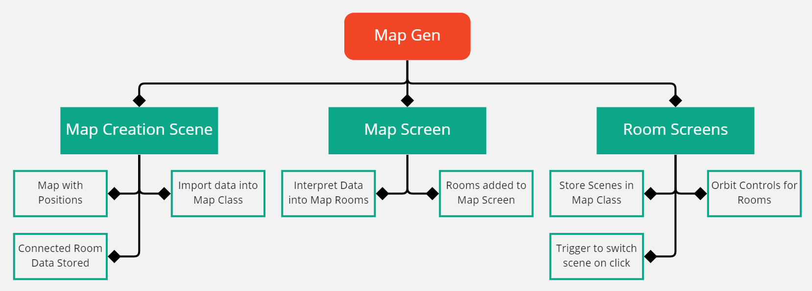

# CYCLE 7 Separate Screens

## Design

### Objectives

In Cycle 7 I wanted to start making the game less of a testing ground and more like a game. This means adding in more of the game logic and also creating the separate screens; these are the map screen and the individual room screens.

I also wanted the game to be able to handle new features in the future like procedural generation with less work needed. Therefore I also wanted to create a system that would do all the generation for me when provided with an array of rooms.

* [x] Create a method for switch between scenes.
* [x] Create a class for the map; that stores rooms and functions.
* [x] Create a function that generates the map scene.
* [x] Create a function that generates all the individual room scenes.
* [x] Make the map screen simple looking.

### Key Variables

| Variable Name       | Usage                                                          |
| ------------------- | -------------------------------------------------------------- |
| SCENE               | The variable that stores which scene is currently being used.  |
| CAMERA              | The variable that stores which camera is currently being used. |
| MapCamera, MapScene | The constants that store the new Map scene and camera.         |

### Pseudocode

```
```

## Development

As in Cycle 6 I will be breaking down this development into multiple parts; this is again because the development is quite long for this cycle.

**Development Part 1:** Scene & Camera Switching

To allow me to have a map screen and also a room screen; I needed to create a method for switching scenes. To do this I created variables for storing which scene and camera is currently active. These can then be changed whilst the game is running and are updated in the animate function.


```javascript
const scene = new THREE.Scene();
const MapView = new THREE.Scene();

let SCENE = scene; // sets to default scene (test map)

const camera = new THREE.PerspectiveCamera( 75, window.innerWidth / window.innerHeight, 1, 100 );
const MapCamera = new THREE.PerspectiveCamera( 75, window.innerWidth / window.innerHeight, 1, 100 );

let CAMERA = camera; // sets to default camera (test map camera)
```


To actually test this out, I had to implement a way to switch scenes while the game was running. This was easy to do thanks to the GUI I had added previously as all I had to do was add two buttons that would switch the scenes and cameras. Then all I had to do was update the render function with the two variables `SCENE` and `CAMERA`.


```javascript
function createPanel() {

    const panel = new GUI( { width: 300 } );

    const helpFolder = panel.addFolder( "Help" );
    const settingFolder = panel.addFolder( "Settings" );

    let settings = {

        "Use the show stats button to see stats.": "0",
        "Show Stats": function() {

            document.body.appendChild( stats.dom );

        },
        "Lock Camera": function() {

            camera.position.set(-10, 40, 10);
            camera.lookAt(-10, 0, 10);
            freecam = false;

        },
        "Free Camera": function() {

            camera.position.set(moveableCube.position.x - 5, moveableCube.position.y + 5, moveableCube.position.z);
            camera.lookAt(moveableCube.position);
            freecam = true;

        },
        "Map Scene": function() {

            SCENE = MapView;
            CAMERA = MapCamera;

        },
        "Test Scene": function() {

            SCENE = scene;
            CAMERA = camera;

        }

    }

    helpFolder.add( settings, "Use the show stats button to see stats." );
    settingFolder.add( settings, "Show Stats" );
    settingFolder.add( settings, "Lock Camera" );
    settingFolder.add( settings, "Free Camera" );
    settingFolder.add( settings, "Map Scene" );
    settingFolder.add( settings, "Test Scene" );

    helpFolder.open();
    settingFolder.open();

}

function animate() { // not the full animate function
    
    requestAnimationFrame( animate );

    stats.update();

    renderer.render( SCENE, CAMERA ); // these variables can be changed to change
                                      // the scene and camera
}

animate();
createPanel();
```


**Development Part 2:** Map Generation

For this part of development I wanted to take what I had learnt in Dev Part 1 and Cycle 6 to make sure the core game logic was in place. To do this I came up with a hierarchy chart style diagram to help plan my implementation.



To begin with I started by working on interpreting the data and then adding them to the Map Scene that I had created in development part one. This involved updating the Map class with a two new variables titled map (for the map scene) and scenes (to hold all the individual scenes). This ticks of a number of things set out above.


```javascript
// the updated map class
class Map {
    constructor(characters, enemy, rooms, map, scenes) {
        this.characters = characters;
        this.enemy = enemy;
        this.rooms = rooms;
        this.map = map;
        this.scenes = scenes;

    }

    createScene(scene) { // this puts all elements in the map creation screen
        this.rooms.forEach(element => {
            element.add(scene);

        });

    }

    createMapScreen() { // this creates the map scene
        for (let i = 0; i < this.rooms.length; i++) {
            let material = new THREE.MeshStandardMaterial({color: 0x000000});
            let outlineMaterial = new THREE.MeshBasicMaterial({color: 0xffffff, side: THREE.BackSide});

            let component = createCube([this.rooms[i].size[0] - 1.5, 1, this.rooms[i].size[2] - 1.5], material);
            let outline = createCube([this.rooms[i].size[0] - 1.5, 1, this.rooms[i].size[2] - 1.5], outlineMaterial);

            component.position.set(this.rooms[i].position[0], 1, this.rooms[i].position[2]);
            outline.position.set(this.rooms[i].position[0], 1, this.rooms[i].position[2]);

            outline.scale.set(1.05,1.05,1.05);
            
            if (this.rooms[i].constructor.name === "Corridor") {
                if (this.rooms[i].orientation === "z") {
                    component.rotation.y = degToRad(90);
                    outline.rotation.y = degToRad(90);

                }

            }

            let mapRoom = new MapRoom([component, outline], this.rooms[i]);
            this.map.push(mapRoom);

        }

    }

    createMap(scene) { // this add all elements to the map scene
        this.createMapScreen();
        this.map.forEach(element => {
            element.components.forEach(component => {
                scene.add(component);

            })

        })

    }

}
```


I also needed to create two more classes so as to be able to store the scene data in a way that was intuitive and uses object orientated programming.


```javascript
class MapRoom {
    constructor(components, link) {
        this.components = components;
        this.link = link;

    }

}

class RoomScene {
    constructor(name, scene, room) {
        this.name = name;
        this.scene = scene;
        this.room = room;

    }

}

export { Map, RoomScene }
```


The reason that the create map scene function is so complicated is because I wanted the map items to have a white outline; this means for each room I had to create two cubes and then make one of them have a THREE.Backside texture. This means that because it is slightly larger than the other cube it appears as on outline.

<figure><figcaption><p>The outline effect of the map screen.</p></figcaption></figure>

**Development Part 3:** Individual Scenes

To begin with I had to complete the final part of the diagram above; meaning that from the map screen I had to generate individual scenes from the map data. Then I had to put a new camera and also a new Corridor or Junction in each scene.


```javascript
// this part takes all the data from the map creation scene
let MAP = new Map([], [], [spawnJunction, c1, c2, c3, c4, c5, c6, j1, j2, j3, j4], [], []);
MAP.createScene(scene);
MAP.createMap(MapView); // creating the map screen

for (let i = 0; i < MAP.rooms.length; i++) {
    let roomScene = new RoomScene(`${MAP.rooms[i].constructor.name}${i}`, new THREE.Scene, MAP.rooms[i]);
    MAP.scenes.push(roomScene);

}
```


I then also created a loop that would create all the individual scenes and push them to the scenes array that is part of the MAP class. This is somewhat complicated as I had to make sure that all rooms stored which type they are and also knew which orientation the corridors were. Scenes also need a light and camera so I had to ensure those were added; but for the moment as a method to test out this loop I just added a function to the UI to switch to room scene one.




```javascript
for (let i = 0; i < MAP.scenes.length; i++) {
    let room;
    let camera = new THREE.PerspectiveCamera( 75, window.innerWidth / window.innerHeight, 1, 100 );
    let roomlight = new THREE.SpotLight( 0x87ceeb, 10 );
    roomlight.target.position.set(-10, 0, 10);
    roomlight.position.set(-10, 50, 10);
    
    if (MAP.scenes[i].room.constructor.name === "Corridor") {
        room = generateCorridor(MAP.scenes[i].room.size, 0xff11ff, [0,0,0], MAP.scenes[i].room.rotation);
        camera.position.set(-5,10,0);
        camera.lookAt(0,1,0);

    }
    if (MAP.scenes[i].room.constructor.name === "Junction") {
        room = generateJunction(MAP.scenes[i].room.size, 0xffffff, [0,0,0]);
        camera.position.set(-5,15,0);
        camera.lookAt(0,1,0);

    }
    
    room.add(MAP.scenes[i].scene);
    MAP.scenes[i].scene.add(camera);
    MAP.scenes[i].scene.add(roomlight);

}
```





```javascript
class RoomScene {
    constructor(name, scene, room) {
        this.name = name;
        this.scene = scene;
        this.room = room;

    }

}
```



```javascript
class Corridor {
    constructor(size, components, position, orientation) {
        this.size = size;
        this.components = components;
        this.position = position;
        this.orientation = orientation;

    }

    add(scene) {
        for (let i = 0; i < this.components.length; i++) {
            scene.add(this.components[i]);

        }

    }

}
```





```javascript
function createPanel() {

    const panel = new GUI( { width: 300 } );

    const helpFolder = panel.addFolder( "Help" );
    const settingFolder = panel.addFolder( "Settings" );

    let settings = {

        "Use the show stats button to see stats.": "0",
        "Show Stats": function() {

            document.body.appendChild( stats.dom );

        },
        "Lock Camera": function() {

            camera.position.set(-10, 40, 10);
            camera.lookAt(-10, 0, 10);
            freecam = false;

        },
        "Free Camera": function() {

            camera.position.set(moveableCube.position.x - 5, moveableCube.position.y + 5, moveableCube.position.z);
            camera.lookAt(moveableCube.position);
            freecam = true;

        },
        "Map Scene": function() {

            SCENE = MapView;
            CAMERA = MapCamera;

        },
        "Test Scene": function() {

            SCENE = scene;
            CAMERA = camera;

        },
        "Switch Scene Test": function() {

            SCENE = MAP.scenes[0].scene;
            CAMERA = camera;

        }


    }

    helpFolder.add( settings, "Use the show stats button to see stats." );
    settingFolder.add( settings, "Show Stats" );
    settingFolder.add( settings, "Lock Camera" );
    settingFolder.add( settings, "Free Camera" );
    settingFolder.add( settings, "Map Scene" );
    settingFolder.add( settings, "Test Scene" );
    settingFolder.add( settings, "Switch Scene Test" );

    helpFolder.open();
    settingFolder.open();

}
```




<figure><figcaption><p>Room Scene One.</p></figcaption></figure>

**Development Part 4:** Linking Everything

